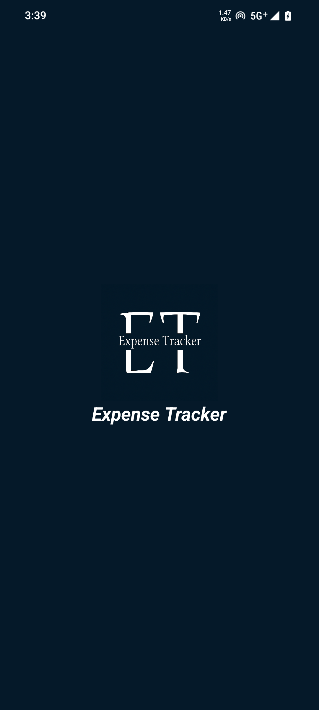
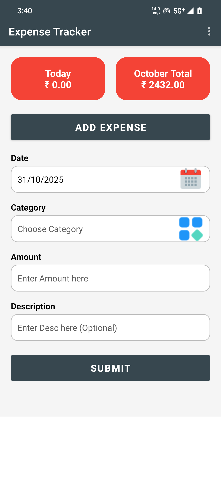
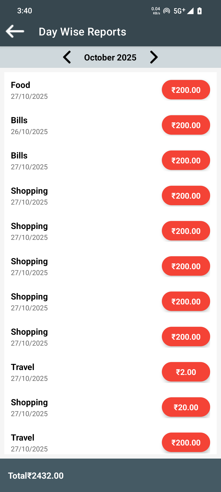
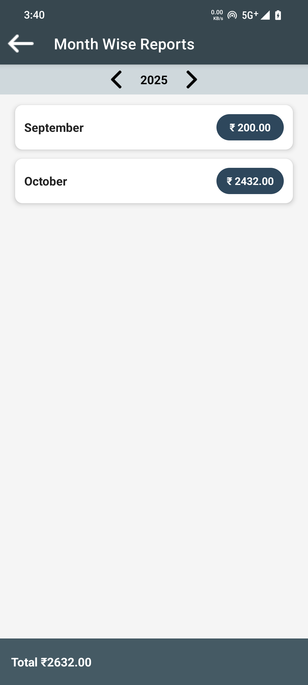

# 💰 Expense Tracker App

Expense Tracker is a simple Android application built as a college project.  
It helps users manage their daily expenses with a clean and easy-to-use interface.

## 📱 App Screens

| Splash | Home | Day-wise | Month-wise |
|--------|------|-----------|-------------|
|  |  |  |  |

## ✨ Features
- Add and edit daily expenses  
- View day-wise and month-wise reports  
- Simple and modern UI design  
- No online database — uses local storage  
- Built with Kotlin and XML layouts  

## 🛠️ Technologies Used
- **Language:** Kotlin  
- **Framework:** Android SDK  
- **IDE:** Android Studio  
- **UI Components:** ConstraintLayout, RecyclerView, CardView, EditText, Button  
- **Storage:** SQLite
---

👨‍💻 *Developed by Thakkar Mitkumar Bharatbhai*
